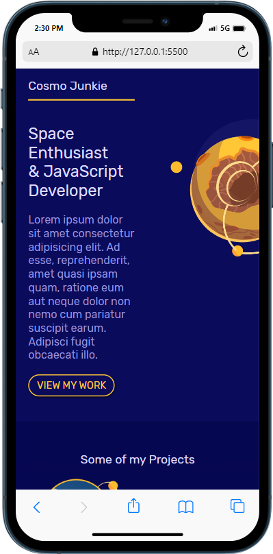
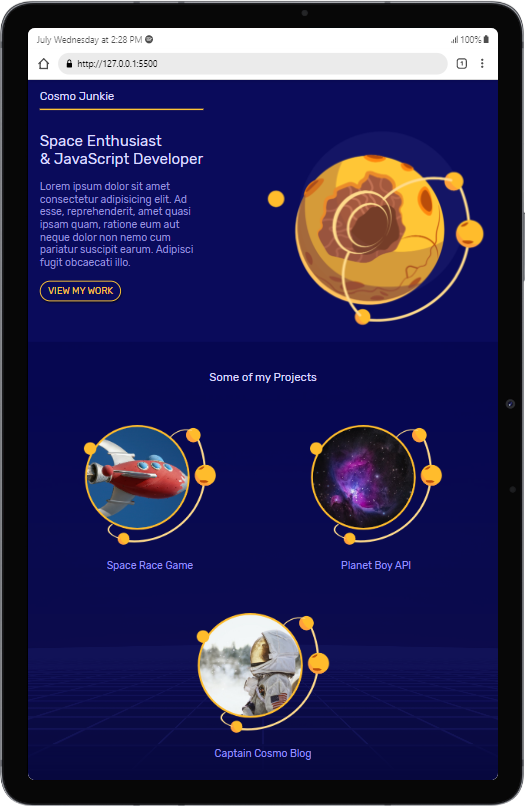
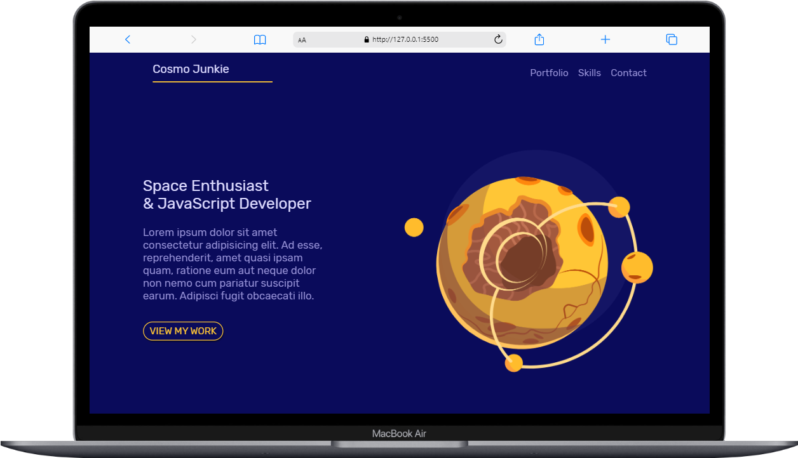

# Responsive Mobile CSS Grid
## About
This website was created following the [nentninja tutorial playlist](https://youtube.com/playlist?list=PL4cUxeGkcC9hH1tAjyUPZPjbj-7s200a4) solely for learning purposes.

## Views
Here are the views of the final website as the appear on various devices.
 

## Comments
This project has been very educative. I have gained perspective on why "mobile first" and how to use grid to simplify layouts.

Here's a [link]() to what I created based on the things I learnt from this project.